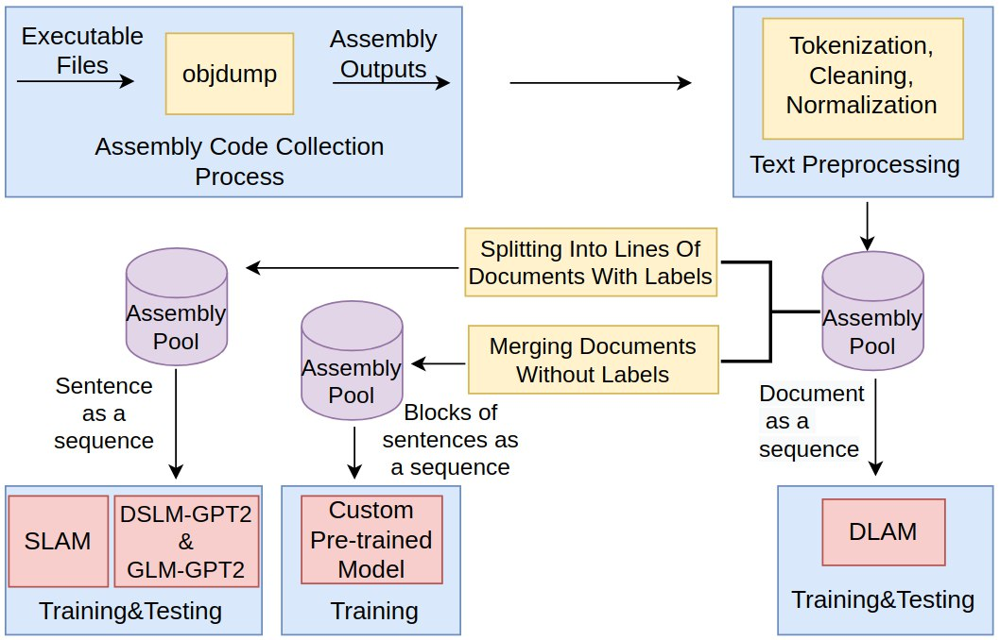

# The DLAM
1. Our study extracts assembly code using an open-source disassembler to create an opcode sequence as output.  
  1.1.  Extract asssembly instructions with [create_dlam_dataset.py](./create_dlam_dataset.py) which internally uses [bin2op.py](./bin2op.py)  
  1.2.  Save asssembly intsructions in seperate files.  
  1.3.  These actions may be done using `python create_dlam_dataset.py --source <Dir_With_PE32_Files> --destination <Dir_to_Save_Output>`  
2. We name the directory that assembly outputs reside as  ***assembly pool***.
3. As shown in  we processed assembly outputs with `custom_standardization` function in [custom_standardization.py](./custom_standardization.py). 
4. To create assembly pool which we will use in the DLAM, first we converted opcode sequences to vectorized form with the layer 
    ```
    vectorize_layer = TextVectorization(
      standardize=custom_standardization,
      max_tokens=max_features,
      output_mode='int',
      pad_to_max_tokens=True,
      ngrams=ngrams,
      output_sequence_length=sequence_length
      )
    ```   
      This layer gives us 
    ```
      Vectorized opcode sequences (<tf.Tensor: shape=(1, 1024),   dtype=int64, numpy=array([[111,  17,  40, ...,  94,  79,    82]])>, <tf.Tensor: shape=(), dtype=int32, numpy=1>)
    ```
    after adaptation `vectorize_layer.adapt(train_text)`  
4. The training, validation and testing dataset seperation and preparation may be seen in [DLAM_TEXT_CLASSIFICATION.html](./00_of_text_classification_dlam.html). 
5.  The DLAM which we constructed as  
    ```
    model = tf.keras.Sequential([
    layers.Embedding(max_features+1, embedding_dim),
    layers.Bidirectional(layers.LSTM(128,dropout = 0.5, recurrent_dropout = 0.5, return_sequences=True)),
    layers.Bidirectional(layers.LSTM(128,dropout = 0.5, recurrent_dropout = 0.5, return_sequences=True)),
    layers.Dropout(0.5),
    layers.GlobalMaxPooling1D(),
    layers.Dropout(0.5),
    layers.Dense(128),
    layers.Dropout(0.5),
    layers.Dense(1)])
    ```

# The SLAM
1.  We split the assesmbly intructions in assembly pool with [prepare_slam_data.py](./prepare_slam_data.py) into lines with labels. static-analysis
Firstly,you should use bin2op.py for converting binary files to opcode file.Then, in first project,...


And for the second project, you can use own_gpts2_pre_trained_outputs for weight initialization to trained binary_classification-own_GPT-2.py.
For  binary_classification-GPT-2.py.
